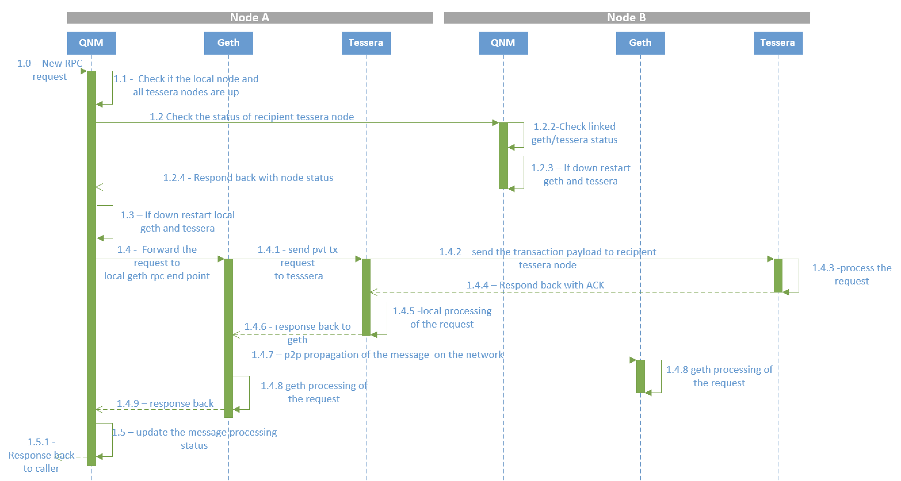

# Node Manager

## Introduction
In large networks it is possible that some of the nodes in the network have low transaction volumes and probably do not receive or initiate transactions for days. However, the node keeps running incurring the infrastructure cost. One of the requirements has been to proactively monitor the transaction traffic at a node and stop the node if its inactive for long.

Node manager is designed to cater to above requirement. The tool is built to:

* Monitor a linked blockchain client and privacy manager for inactivity
* Hibernate the linked blockchain client and privacy manager if its inactive beyond certain configured time
* Restart the blockchain client and privacy manager upon new transaction/calls 

Node Manager acts as a proxy for the blockchain client and privacy manager nodes. When running with node manager it is expected that all clients would submit requests to the corresponding node manager proxy servers instead of directly to the blockchain client or privacy manager nodes.

## Design

### Architecture
The diagram below depicts a network of 3 nodes with node manager running on each node.

Each node manager acts as a proxy for the linked blockchain client and privacy managers and monitors the activity on these. The node manager also communicates with other node managers to retrieve the remote node status.

### Sample request processing flow when local and remote nodes are down

Processing of private transaction request between nodes A and B. Both nodes are managed by node manager.

## Key Features

- Supports both pure and hybrid deployment models. 
- Periodic sync
    - You can configure node manager to bring up the nodes periodically for syncing up with network. This would prevent nodes from going out of sync during hibernation.
- TLS
    - 1-way and 2-way (mutual) TLS can be configured on each of Node Manager's servers, clients, and proxies.  
- node manager supports block chain clients goQuorum & Besu and privacy manager Tessera. 

### Private transaction handling flow
When node manager receives a private transaction request from user it handles it as explained below:
1. Parses the transaction and extracts the participant node's public keys. 
2. Finds peer node manager matching the public key from [peers config](CONFIG.md#Peers-config-file). If a matching entry is not found in config, it assumes that participant node is not managed by node manager and ignores the status of that node.
3. Requests peer node manager via RPC call to bring up the nodes if they are down.
4. If one of the participant node (managed by node manager) is down, it replies to the user with internal server error to try after sometime. 
5. If all participant nodes (managed by node manager) are up then it processes the request.

### How stopping of block chain client and privacy manager is handled
Node manager tries to stop the nodes after a configurable period of inactivity as explained below.
- Consensus validation
    - When strict mode is enabled
        - It will not stop the block chain client if it is a consensus node. A consensus node is a node that participates in consensus. Example: Clique - signer node, IBFT - validator node, RAFT - minter or follower node.
    - If stopping the blocking chain client will affect the quorum of the consensus nodes then node manager will not stop it. The quorum check will depend on the consensus used. 
- Peer validation
    - Node manager sets its own status to `shutdown in progress` after a random delay.
    - Node manager will not stop the block chain client if any of its peer from [peers config](CONFIG.md#Peers-config-file) is already performing a shutdown operation or wait for nodes to come up. 
- If consensus and peer validation passes, it stops both block chain client and privacy manager.
- If consensus or peer validation fails, it skips stopping the nodes and waits for the next period of inactivity.
 
### Error handling for user
User's request to node manager will fail under the following scenarios.

| Scenario  | Error message received by user | Action required |
| --- | --- | --- |
| node manager receives a request from user while block chain client and privacy manager are being stopped by it due to inactivity. | 500 (Internal Server Error) - `node is being shutdown, try after sometime` | Retry after some time. |  
| node manager receives a request from user while block chain client and privacy manager are being started up by it due to activity. | 500 (Internal Server Error) - `node is being started, try after sometime` | Retry after some time. |  
| node manager receives a private transaction request from user and participant node(of the transaction) managed by node manager is down. | 500 (Internal Server Error) - `Some participant nodes are down` | Retry after some time. |  
| node manager receives a request from user when starting/stopping of block chain client or privacy manager by node manager failed. | 500 (Internal Server Error) - `node is not ready to accept request` | Investigate the cause of failure and fix the issue. |  

Node manager will consider its peer is down and proceed with processing if it is not able to get a response from its peer node manager when it tries to check the status for stopping nodes or handling private transaction.

### Deployment
Node manager must run in the same host where block chain client and privacy manager are running.
You can run node manager, block chain client and privacy manger as host process or docker container as given below.

| Node Manager  | GoQuorum/Besu | Privacy Manager(Tessera) |
| --- | --- | --- |
| host process | host process | host process |
| host process | docker | docker |
| docker | docker | docker | 
 

## Build, Run and Configuration
Refer [here](CONFIG.md) for build, run & configuration details.