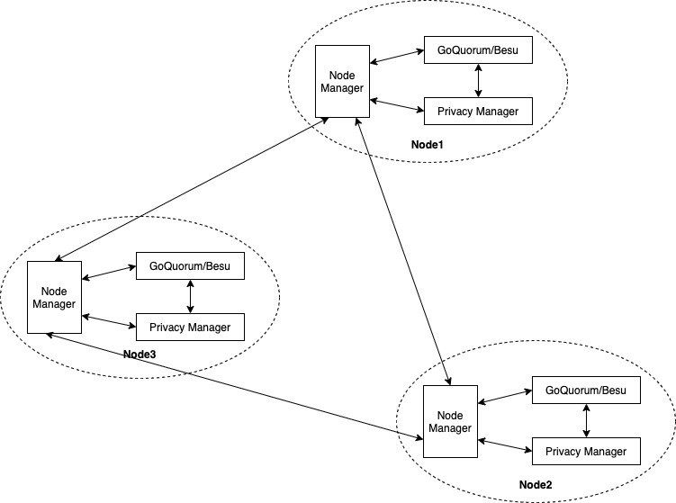

# Node Manager

Node Manager is a tool that monitors activity in a blockchain client and Quorum privacy manager node pair, stops them after a configurable period of inactivity, and restarts them on incoming requests.

Node Manager acts as a proxy for the blockchain client and privacy manager nodes.  When Node Manager receives a request from a client, it will bring up the blockchain client and privacy manager nodes if they are down, and forward the request to the relevant node.

Clients should submit requests to the corresponding Node Manager proxy servers instead of directly to the blockchain client or privacy manager nodes.

User's request to node manager will fail under the following scenarios.

| Scenario  | error message received by user | action required |
| --- | --- | --- |
| node manager receives a request from user while block chain client and privacy manager are being shut down by it due to inactivity. | `node is being shutdown, try after sometime` | Retry after some time. |  
| node manager receives a request from user while block chain client and privacy manager are being started up by it due to activity. | `node is being started, try after sometime` | Retry after some time. |  
| node manager receives a private transaction request from user and participant node(of the transaction) managed by node manager is down. | `Some participant nodes are down` | Retry after some time. |  
| node manager receives a request from user when starting/stopping of block chain client or privacy manager by node manager failed. | `node is not ready to accept request` | Cause of failure should be investigated, fixed and node manager restarted. |  
 
## Design

#### Architecture



#### Usage
Node manager must run in the same host where block chain client and privacy manager are running.
You can run node manager, block chain client and privacy manger in any of the following ways.

| Node Manager  | Quorum/Besu | Privacy Manager(Tessera) |
| --- | --- | --- |
| host process | host process | host process |
| host process | docker | docker |
| docker | docker | docker |

#### TLS

- It supports both 1-way and mutual (2-way) TLS between user and node manager. 
- It supports both 1-way and mutual (2-way) TLS between node manager and tessera.
- The TLS between node manager and quorum is 1-way.


## Build

```bash
go install
```

## Run

```bash
node-manager --config path/to/config.json --verbosity 3
```

| Flag | Description |
| --- | --- |
| `--config` | Path to `.json` or `.toml` configuration file |
| `--verbosity` | Logging level (`0` = `ERROR`, `1` = `WARN`, `2` = `INFO`, `3` = `DEBUG`) |

## Using Docker

### Build
```bash
docker build . -t node-manager
```

### Run

- A configuration must be supplied to the Docker container. Refer to sample config files [config.toml](config.docker.local.toml) and [nodemanager.toml](nodemanger.docker.local.toml)
```bash
docker run -p <port mapping> -v /var/run/docker.sock:/var/run/docker.sock --mount type=bind,source=<path to config>,target=/config.toml node-manager:latest

```
example
```bash
docker run -p 8081:8081 -p 9091:9091 -p 9391:9391 -v /var/run/docker.sock:/var/run/docker.sock --mount type=bind,source=/usr/john/node1.toml,target=/config.toml --mount type=bind,source=/usr/john/nm1.toml,target=/nm1.toml node-manager:latest -config /config.toml
```
Note: `-v /var/run/docker.sock:/var/run/docker.sock` is required to start/stop blockchain client/privacy manager running as docker container.

## Config

Two config files are required: [Node Manager](#Node-Manager-config-file) and [Peers](#Peers-config-file).  `json` and `toml` formats are supported.  Samples can be found in [`config/reader_test.go`](config/reader_test.go) and [`config/peers_test.go`](config/peers_test.go).

### Node Manager config file

| Field  | Type | Description |
| --- | --- | --- |
| `name` | `string` | Name for the node manager |
| `disableStrictMode` | `bool` | Strict mode prevents blockchain client nodes involved in the consensus from being hibernated.  This protects against an essential node being shut down and preventing the chain from progressing. |
| `upcheckPollingInterval` | `int` | Interval (in seconds) for performing an upcheck on the blockchain client and privacy manager to determine if they have been started/stopped by a third party (i.e. not node manager) |
| `peersConfigFile` | `string` | Path to a [Peers config file](#Peers-config-file) |
| `inactivityTime` | `int` | Inactivity period (in seconds) to allow on either the blockchain client or privacy manager before hibernating both |
| `resyncTime` | `int` | Time (in seconds) after which a hibernating node pair should be restarted to allow the node to sync with the chain.  Regularly syncing a node with the chain during periods of inactivity will reduce the time needed to prepare the node when receiving a client request. |
| `server` | `object` | See [server](#server) |
| `proxies` | `[]object` | See [proxy](#proxy) |
| `blockchainClient` | `object` | See [blockchainClient](#blockchainClient) |
| `privacyManager` | `object` | See [privacyManager](#privacyManager) |

#### server

The RPC server that exposes Node Manager's API.

| Field  | Type | Description |
| --- | --- | --- |
| `rpcAddress` | `string` | Listen address for the Node Manager API |
| `rpcCorsList` | `[]string` | List of domains from which to accept cross origin requests (browser enforced) |
| `rpcvHosts` | `[]string` |  List of virtual hostnames from which to accept requests (server enforced) |
| `tlsConfig` | `object` | See [serverTLS](#serverTLS) |

#### proxy

The proxy server for a single blockchain client or privacy manager service.  Multiple proxies can be configured.

| Field  | Type | Description |
| --- | --- | --- |
| `name` | `string` | Name of the proxy server |
| `type` | `string` | `http` or `ws` |
| `proxyAddress` | `string` | Listen address for the proxy server |
| `upstreamAddress` | `string` | Address of the blockchain client or privacy manager service |
| `proxyPaths` | `[]string` | Paths the proxy server should listen on (`/` listens on all paths) |
| `ignorePathsForActivity` | `[]string` | Paths that should not reset the inactivity timer if called  |
| `readTimeout` | `int` | Read timeout |
| `writeTimeout` | `int` | Write timeout |
| `proxyTlsConfig` | `object` | See [serverTLS](#serverTLS) |
| `clientTlsConfig` | `object` | See [clientTLS](#clientTLS) |

#### blockchainClient

The blockchain client to be managed by the Node Manager.

| Field  | Type | Description |
| --- | --- | --- |
| `type` | `string` | `goquorum` or `besu` |
| `consensus` | `string` | `raft`, `istanbul`, or `clique` |
| `rpcUrl` | `string` | RPC URL of blockchain client.  Used when performing consensus checks. |
| `process` | `object` | See [process](#process) |
| `tlsConfig` | `object` | See [clientTLS](#clientTLS) |

#### privacyManager

The privacy manager to be managed by the Node Manager.

| Field  | Type | Description |
| --- | --- | --- |
| `publicKey` | `string` | Privacy manager's base64-encoded public key |
| `process` | `object` | See [process](#process) |
| `tlsConfig` | `object` | See [clientTLS](#clientTLS) |

##### process

The blockchain client or privacy manager process.  Can be a standalone shell process or a Docker container. 

| Field  | Type | Description |
| --- | --- | --- |
| `name` | `string` | `bcclnt` or `privman` |
| `controlType` | `string` | `shell` or `docker` |
| `containerId` | `string` | Docker container ID.  Required if `controlType = docker` |
| `startCommand` | `[]string` | Shell command to start process.  Required if `controlType = shell` |
| `stopCommand` | `[]string` | Shell command to stop process.  Required if `controlType = shell` |
| `upcheckConfig` | `object` | See [upcheckConfig](#upcheckConfig) |

##### upcheckConfig

How Node Manager should determine whether the process is running or not.

| Field  | Type | Description |
| --- | --- | --- |
| `url` | `string` | Process upcheck URL |
| `returnType` | `string` | `string` or `rpcresult`. Provides support for REST upcheck endpoints and RPC endpoints |
| `method` | `string` | `GET` or `POST`. HTTP request method required for upcheck endpoint  |
| `body` | `string` | Body of RPC upcheck request  |
| `expected` | `string` | Expected response if `returnType = string`. |

##### serverTLS

1-way and mutual (2-way) TLS can be configured as required.

| Field  | Type | Description |
| --- | --- | --- |
| `keyFile` | `string` | Path to `.pem` encoded key file |
| `certificateFile` | `string` | Path to `.pem` encoded certificate file |
| `clientCaCertificateFile` | `string` | Path to `.pem` encoded CA certificate file to validate client |

##### clientTLS

1-way and mutual (2-way) TLS can be configured as required.

| Field  | Type | Description |
| --- | --- | --- |
| `insecureSkipVerify` | `bool` | Skip verification of server certificate if `true` |
| `caCertificateFile` | `string` | Path to `.pem` encoded CA certificate file to validate server |
| `keyFile` | `string` | Path to `.pem` encoded key file |
| `certificateFile` | `string` | Path to `.pem` encoded certificate file |

#### Peers config file

It contains list of other node managers in the network. This config can be updated whenever there is a change. 
It is used by node manager to check the status of other node managers when it decides to shut down.
Node manager always reads the latest information from this config before performing the checks. Any updates
 to the config file takes effect immediately.

| Field  | Type | Description |
| --- | --- | --- |
| `peers` | `[]object` | See [peer](#peer) |

##### peer

Another active Node Manager in the network.  Multiple peers can be configured.

| Field  | Type | Description |
| --- | --- | --- |
| `name` | `string` | Name of the peer |
| `privacyManagerKey` | `string` | Public key of the peer's privacy manager |
| `rpcUrl` | `string` | URL of the peer's RPC server |
| `tlsConfig` | `object` | See [clientTLS](#clientTLS) |
